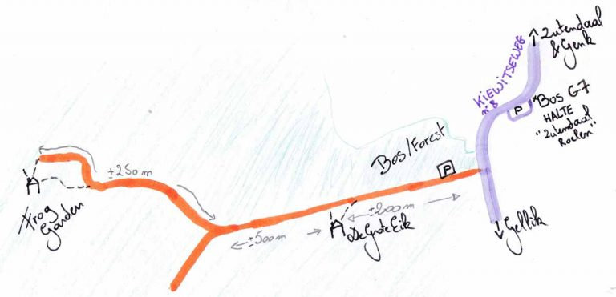

Hoe kun je ons bereiken?
<!--more-->

☎: +0031 (0)649833582
✉: [e-mail](mailto:contact@degroteeik.be)

# Route

Gebruik voor de automatische navigatie dit adres (niet het onze): Kiewitseweg 8 , 3690 Zutendaal, Belgie.

## Fiets
We zitten dichtbij het fietsknooppunten netwerk, een netwerk van bewegwijzerde
toeristische fietsroutes in Vlaanderen, Nederland en in mindere mate Duitsland
en Wallonië.  We zitten tussen knooppunt 62 (Bessemer) en 65 (Gellik). Je kan
je route plannen via [Route.nl](http://route.nl) ( ze hebben ook een goede app en ook wandelroutes
onder andere de GR routes) of via [Fietsnet.be](http://fietsnet.be).  Er zijn ook een aantal
[fietssnelwegen](http://fietssnelwegen.be).

## Openbaar vervoer

### Vanuit Belgie

Via Genk (trein/bus station): neem bus G7 en stap uit op de halte ‘Zutendaal Roelen’ (laatste halte)

### Vanuit Nederland
Via Maastricht (trein/bus station): neem bus 45 (van De Lijn, de Belgische busmaatschappij) richting Genk . Stap af aan de halte “Oudkantoor straat”.
Wandel instructies vanaf [hier](https://www.google.be/maps/dir/Lanaken+Oud+Kantoorstraat,+3620+Lanaken/50.9051407,5.5981976/@50.9101071,5.5959734,15z/data=!4m14!4m13!1m10!1m1!1s0x47c0dd1fb9afc865:0x6f138c71813c70dd!2m2!1d5.6107507!2d50.9179786!3m4!1m2!1d5.6106575!2d50.9133091!3s0x47c0dd1f30e8e50f:0x73f7ea428989f53e!1m0!3e2) (1.7KM / 21 min) : Steek over in de richting van Dr. Johns Clinic. Ga de eerste straat naar link en ga weer naar links, deze weg leidt je in een bos. Neem de eerste straat rechts ( Hertenweg) en volg die tot op het einde an ga naar links. Je bent nu op de Kiewitseweg, volg deze voor 100 meter en ga rechts de parking van het bos op. Volg de bos weg voor 200 meter en je ziet ons huis.

## Auto (vanuit Belgie)

Neem de E314 naar Genk-Oost/Zutendaal (32). Rijdt door Wiemesmeer, en aan het
rond punt ga naar links richting Zutendaal centrum, aan het volgende rondpunt
(dit is het centrum) ga je rechtdoor en znel zie je een bord naar Gellik, draai
hier rechts (richting Gellik).

Blijf rechtdoor gaan, ongeveer 4km, je zal nog een rondpunt passeren, blijf
rechtdoor gaan totdat je in een kleine woonkern komt Roelen ( bord aan je
linker kant). Volg nog 50 meter en sla rechts de bosparking op, 200 meter
verder zie je ons huis.

## Liften

Via E314 Afrit/Oprit Genk-Oost /Zutendaal (32) Vanuit de bosparking > Zutendaal > Rotonde aan het “t soete Frietje” > Wiesemeer > Genk-Oost (richting Maasmechelen & Nederland & richting Leuven, Brussels, Gent, Coast )

[hitchwiki.org](http://hitchwiki.org) is DE bron voor elke beginnende en gevorderde lift-st-er wereledwijd.

## Coordinaten

- De Grote Eik: 50°54’18.4″N 5°35’53.6″E [Google](https://goo.gl/maps/bs8xUf2m52xZtdcz8) [OpenStreetMap](https://www.openstreetmap.org/#map=18/50.90516/5.59834)
- Frog Garden: 50°54’08.2″N 5°35’07.5″E [Google](https://www.google.be/maps/place/50%C2%B054'07.1%22N+5%C2%B035'07.2%22E/@50.902178,5.5856704,259m/data=!3m1!1e3!4m13!1m6!3m5!1s0x47c0dd10d0b7bb9f:0x8b368699156552ee!2sZutendaal+Roelen!8m2!3d50.9071204!4d5.6036948!3m5!1s0x0:0x0!7e2!8m2!3d50.9019609!4d5.5853209) [OpenStreetMap](https://www.openstreetmap.org/note/2528692)
- Bos Parking (alleen overdag): 50°54’22.0″N 5°36’07.6″E [Google](https://goo.gl/maps/fEcHHJ2PMcyCt2q19) [OpenStreetMap](https://www.openstreetmap.org/#map=19/50.90609/5.60198)
- Parking in Roelen:  50°54’25.7″N 5°36’12.4″E [Google](https://goo.gl/maps/QFrBwc9r6NqM9u2R6) [OpenStreetMap](https://www.openstreetmap.org/#map=19/50.90719/5.60351)
